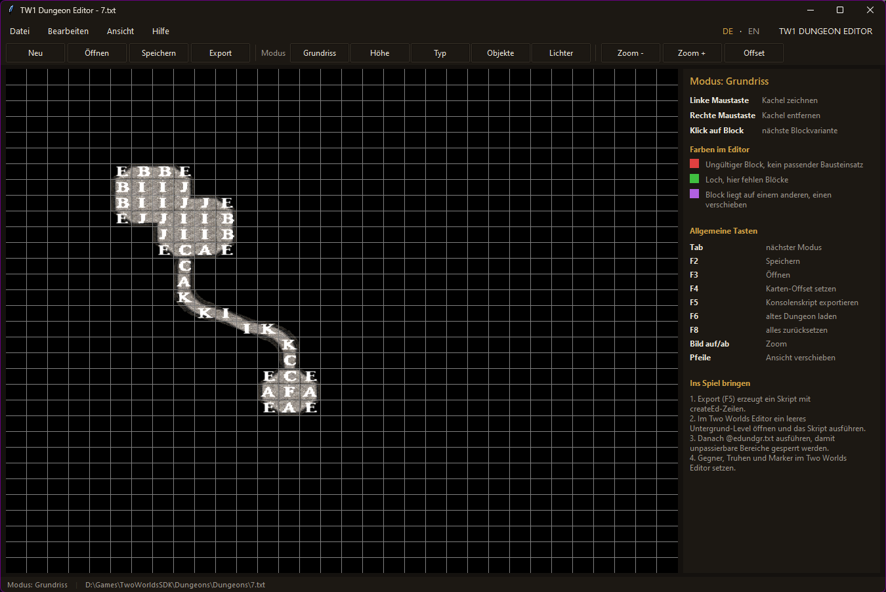

# TW1 Dungeon Editor

Version 0.1.1

A usable window around the original **Dungeons.exe** from the Two Worlds SDK
(Reality Pump, 2007). The original dungeons of Two Worlds were built with this
editor, but it has no interface at all, only hotkeys. This tool embeds it and
adds a menu bar, a toolbar, a hint panel, a status bar and a first-start guide.
English and German, switchable at runtime.

Deutsche Anleitung weiter unten.



## What you need

- **Windows**
- **The Two Worlds SDK**, which contains `Dungeons\Dungeons.exe`. This repository
  does not include it (copyright Reality Pump / TopWare).

## Install

**Option A, exe (no Python needed):**
Download `TW1DungeonEditor.exe` from the
[Releases](https://github.com/MedievalDev/TW1_DungeonEditor/releases) page and
start it. On the first start it asks for `Dungeons.exe`. Pick the one in
`TwoWorldsSDK\Dungeons`. Settings are stored in `%LOCALAPPDATA%\TW1DungeonEditor`.

**Option B, Python:**
Python 3.10+ with tkinter, no other packages. Clone or download this repository
and start `TW1 Dungeon Editor.bat` or `py dungeon_editor.py`. If you place the
folder inside `TwoWorldsSDK\Dungeons`, the editor is found automatically.

## Workflow

1. **Layout** mode: left mouse button draws tiles, right mouse button removes
   them. The editor picks the matching wall and corridor blocks (letters A to M).
   Red means no matching block set, green is a hole, violet is a block overlap.
2. **Height** mode: click a block to change its variant or height.
3. **Type** mode: select blocks and use the mouse wheel to set the dungeon type
   (DUN 01 to 07b, Cave, Mine, as defined in `dungeon.txt`).
4. **Objects / Lights** mode: place torches and lights.
5. **Save** (F2) stores the grid, **Export** (F5) writes a console script of
   `createEd` lines.
6. In the Two Worlds Editor open an empty underground level and run the script.
   Then run `@edundgr.txt` so impassable areas get disabled.
7. Place enemies, chests and markers in the Two Worlds Editor as usual.

The SDK folder `Dungeons\Dungeons` contains the grids of the original game
dungeons (`1.txt` to `15.txt`). Open one of them to see how they were built.

## How it works

The tool starts `Dungeons.exe`, reparents its window into a Tk frame and sends
the original hotkeys (F2 to F8, Tab, Page Up/Down, arrows) with `PostMessage`.
Mode, file and unsaved state are read from the editor's window title. The exe
itself is never modified.

## Limits

- The drawing area is fixed at 1024 x 768, the old editor cannot resize.
- No undo, the old editor has none.
- Save, Open and Export use the editor's own file dialogs.

## Build the exe yourself

```
py -m pip install pyinstaller
build_exe.bat
```

Result: `dist\TW1DungeonEditor.exe`. `py test_i18n.py` checks that every German
text has an English translation.

---

# Deutsch

Ein bedienbares Fenster um die originale **Dungeons.exe** aus dem Two Worlds SDK.
Mit dem Editor wurden die Dungeons des Spiels gebaut, er hat aber keine
Oberfläche, nur Hotkeys. Dieses Tool bettet ihn ein und ergänzt Menüleiste,
Werkzeugleiste, Hinweis-Panel, Statuszeile und einen Guide beim ersten Start.

## Voraussetzungen

- Windows
- Das **Two Worlds SDK** mit `Dungeons\Dungeons.exe`. Die Exe ist nicht im Repo
  enthalten (Copyright Reality Pump / TopWare).

## Installation

- **Exe:** `TW1DungeonEditor.exe` unter
  [Releases](https://github.com/MedievalDev/TW1_DungeonEditor/releases)
  herunterladen und starten. Beim ersten Start `TwoWorldsSDK\Dungeons\Dungeons.exe`
  auswählen.
- **Python:** Python 3.10+ mit tkinter. Repo herunterladen und
  `TW1 Dungeon Editor.bat` starten. Liegt der Ordner in `TwoWorldsSDK\Dungeons`,
  wird der Editor automatisch gefunden.

## Ablauf

1. Modus **Grundriss**: linke Maustaste zeichnet, rechte entfernt.
2. Modus **Höhe**: Klick auf einen Block wechselt Variante und Höhe.
3. Modus **Typ**: Blöcke wählen, mit dem Mausrad den Dungeon-Typ setzen.
4. Modi **Objekte** und **Lichter**: Fackeln und Lichter setzen.
5. **Speichern** (F2) sichert das Raster, **Export** (F5) schreibt das Konsolenskript.
6. Im Two Worlds Editor ein leeres Untergrund-Level öffnen, das Skript ausführen,
   danach `@edundgr.txt`.
7. Gegner, Truhen und Marker wie gewohnt im Two Worlds Editor setzen.

## Credits

- Dungeons.exe and the Two Worlds SDK: Reality Pump / TopWare Interactive.
  Not distributed here.
- This tool: MedievalDev.

Alchemy Fox: <https://alchemy-fox.de/>
Community: <https://twmp.alchemy-fox.de/>
